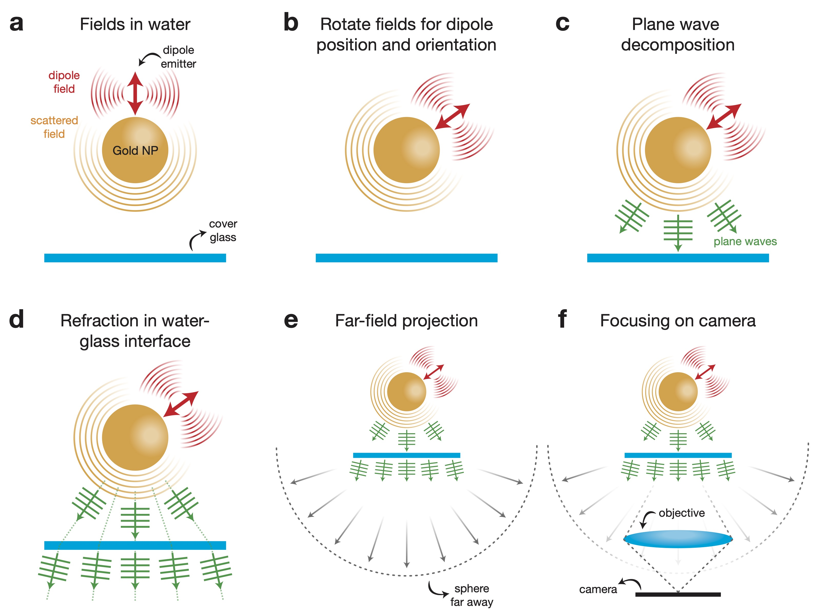
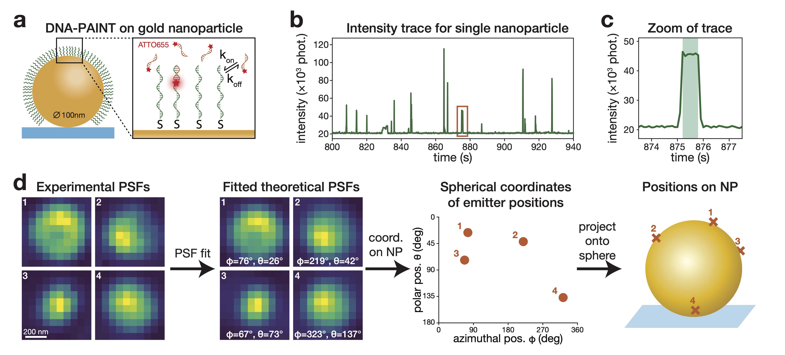

[](https://codecov.io/gh/TeunHuijben/ALPaCA)


# ALPaCA
This repository contains code to calculate the analytical PSF for an emitter near a spherical nanoparticle, as published in: **Point-spread function deformations unlock 3D localization microscopy on spherical nanoparticles [(arXiv)](https://arxiv.org/abs/2306.08148)**. 

- [Introduction](#introduction)
- [Installation](#installation)
- [Examples](#examples)
- [Citation](#citation)


# Introduction
The Analytical PSF Calculator (ALPaCA), uses an analytical model to compute the light intensity on every camera pixel. The image below shows a schematic overview of the process of calculating the PSF of a dipole emitter next to a spherical nanoparticle.

<div align="center">
    
</div>

*The process is composed of 6 steps: **a** calculation of the EM-fields in the water medium for a standard dipole, fixed in orientation and positioned on top of an NP, in terms of spherical waves, **b** rotation and interpolation of the fields to obtain the desired dipole position/orientation, **c** decomposition of the fields into plane waves, **d** refraction of the plane waves in the water-glass interface, **e** projection of the fields into the far-field, and **f** focusing the fields onto the camera. Schematics are not to scale.*

Our analytical PSF model can be employed in a fitting procedure to study the surface distribution of single-stranded DNA on spherical dielectric and metallic NPs in 3D, as visually explained in the figure below. See our [paper](https://arxiv.org/abs/2306.08148) for more details. 

<div align="center">
    
</div>


# Installation
If you want to run ALPaCA locally on your computer, use the following code to clone the repository and install the package. We recommend cloning and installing ALPaCA in a clean conda environment. Alternatively, you can leave out the first two lines, or run the code in via Google Colab (see examples below).

```
conda create -n alpaca python
conda activate alpaca
git clone https://github.com/TeunHuijben/ALPaCA.git
cd alpaca
pip install .
```

# Examples
We have included three examples to get everyone started with the code: 
1. calculate a PSF
2. calculate PSFs for a range of settings
3. fit an experimental spot

You can either clone and install the ALPaCA repository as explained above or run them in Google Colab:

- example 1:  <a target="_blank" href="https://colab.research.google.com/github/TeunHuijben/ALPaCA/blob/main/examples/colab_notebooks/example1_colab.ipynb">
  
</a>

- example 2:  <a target="_blank" href="https://colab.research.google.com/github/TeunHuijben/ALPaCA/blob/main/examples/colab_notebooks/example2_colab.ipynb">
  
</a>

- example 3: TODO

(**Note:** When opening the notebook in Google Colab, you may see a warning that says "Warning: This notebook was not authored by Google." This is a standard security message from Google, and you can safely proceed by clicking "Run anyway."
)

# Citation

If our analytical PSF is useful for your research, please cite the paper:

```
@article{huijben2023exact,
  title={Exact particle-enhanced point-spread function unlocks 3D super-resolution localization microscopy on nanoparticles},
  author={Huijben, Teun APM and Mahajan, Sarojini and Zijlstra, Peter and Marie, Rodolphe and Mortensen, Kim I},
  journal={arXiv preprint arXiv:2306.08148},
  year={2023}
}
```

